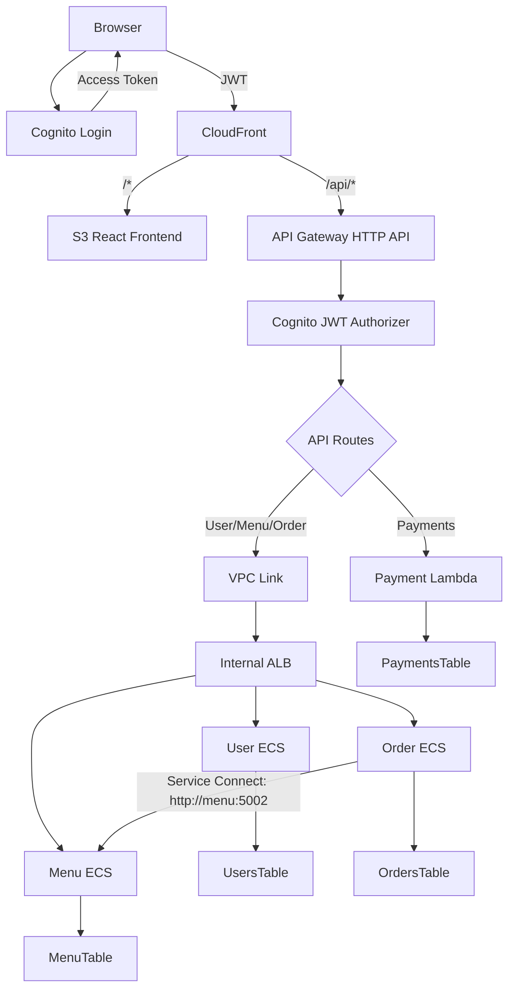

# Foodie WE Restaurant Management System

Foodie WE is a working full-stack MVP for a single-restaurant ordering and staff management application. It uses a React/Vite frontend, independently runnable Node.js services for local development, and Terraform-managed AWS infrastructure for the target deployment.

## Architecture



Each backend service has its own `server.js`, `package.json`, `.env.example`, and `src/` folders for controllers, routes, services, repositories, middleware, config, and utils. User, Menu, and Order also keep Dockerfiles because CI/CD builds those services into ECS container images. Payment is packaged as a Lambda ZIP for production. Services do not read each other's repositories. The Order Service calls the Menu Service REST API to calculate trusted order totals.

The only required service-to-service dependency today is `Order Service -> Menu Service`. Locally, this is configured with `MENU_SERVICE_URL=http://localhost:5002`. In AWS it becomes an ECS Service Connect name such as `MENU_SERVICE_URL=http://menu:5002`.

The current architecture has no notification/email feature.

## Services

| Service | Port | Purpose |
| --- | --- | --- |
| User Service | `5001` | Mock Cognito-style current user and profile APIs |
| Menu Service | `5002` | Foodie WE categories, menu items, and admin menu management |
| Order Service | `5003` | Order creation, status changes, cancellation, and order history |
| Payment Service | `5004` locally | Simulated payments and refunds; production target is Lambda behind API Gateway |
| Frontend | `5173` locally | Customer ordering UI and admin dashboard; production target is S3 + CloudFront |

Every backend exposes `GET /health` with `{ "status": "healthy", "service": "<service-name>" }`.

## Install

Install dependencies in each app:

```bash
cd services/user-service && npm install
cd ../menu-service && npm install
cd ../order-service && npm install
cd ../payment-service && npm install
cd ../../frontend && npm install
```

## Run Locally

Open separate terminals:

```bash
cd services/user-service
npm run dev
```

```bash
cd services/menu-service
npm run dev
```

```bash
cd services/order-service
npm run dev
```

```bash
cd services/payment-service
npm run dev
```

```bash
cd frontend
npm run dev
```

URLs:

- Frontend: `http://localhost:5173`
- User Service: `http://localhost:5001`
- Menu Service: `http://localhost:5002`
- Order Service: `http://localhost:5003`
- Payment Service: `http://localhost:5004`

## Local Development

Run each service individually in its own terminal for debugging and local development. Keep `MENU_SERVICE_URL=http://localhost:5002` for the Order Service.

## Environment Variables

Frontend:

```text
VITE_API_BASE_URL=
VITE_USER_API_URL=http://localhost:5001
VITE_MENU_API_URL=http://localhost:5002
VITE_ORDER_API_URL=http://localhost:5003
VITE_PAYMENT_API_URL=http://localhost:5004
VITE_MOCK_USER_ID=user-1
VITE_MOCK_USER_NAME=Foodie WE Guest
VITE_MOCK_USER_ROLE=USER
```

Backend:

```text
PORT=<service port>
NODE_ENV=development
FRONTEND_ORIGIN=http://localhost:5173
MENU_SERVICE_URL=http://localhost:5002
MOCK_COGNITO_SUB=mock-cognito-sub-123
MOCK_USER_ID=user-1
MOCK_USER_ROLE=USER
PAYMENT_SUCCESS_RATE=0.9
USERS_TABLE_NAME=UsersTable
MENU_TABLE_NAME=MenuTable
ORDERS_TABLE_NAME=OrdersTable
PAYMENTS_TABLE_NAME=PaymentsTable
COGNITO_USER_POOL_ID=
COGNITO_APP_CLIENT_ID=
```

For local development, leave `VITE_API_BASE_URL` empty and use the four per-service URLs. For production behind one CloudFront domain, set `VITE_API_BASE_URL` to the CloudFront origin and the frontend API layer will call `/api/users`, `/api/menu`, `/api/orders`, and `/api/payments`. CloudFront forwards `/api/*` to API Gateway.

## Temporary Mock Authorization

The app currently supports two roles:

```text
USER
ADMIN
```

The frontend role is centralized in `frontend/src/config/mockAuth.js` and can be changed with:

```text
VITE_MOCK_USER_ROLE=ADMIN
```

The frontend sends temporary mock identity headers with API requests:

```text
x-mock-user-id: user-1
x-mock-user-role: USER or ADMIN
```

Local backend authorization is enforced by reusable `requireAuth` and `requireAdmin` middleware in the protected services. For direct API testing, omit or set `x-mock-user-role: USER` to verify `403 Forbidden`, use `x-mock-user-role: ADMIN` to verify access, and set `x-mock-authenticated: false` to verify `401 Unauthorized`.

This is intentionally temporary for local development. In AWS, API Gateway performs Cognito JWT validation before traffic reaches ECS. API Gateway overwrites internal identity headers such as `x-user-id`, `x-user-groups`, and `x-user-email` with validated authorizer claims before forwarding to the internal ALB. ECS services should use that trusted forwarded identity context for application authorization and must not trust browser-supplied identity headers directly.

## API Endpoints

User Service:

- `GET /api/users/:id`
- `GET /api/users/me`
- `PUT /api/users/me`

Menu Service:

- `GET /api/menu`
- `GET /api/menu/items`
- `GET /api/menu/items/:id`
- `GET /api/menu/category/:category`
- `POST /api/menu/items` admin only
- `PUT /api/menu/items/:id` admin only
- `DELETE /api/menu/items/:id` admin only
- `PATCH /api/menu/items/:id/availability` admin only

Order Service:

- `POST /api/orders`
- `GET /api/orders` admin only
- `GET /api/orders/:id` order owner or admin
- `GET /api/orders/user/:userId` matching user or admin
- `PATCH /api/orders/:id/status` admin only
- `POST /api/orders/:id/cancel` order owner or admin

Payment Service:

- `POST /api/payments`
- `GET /api/payments/:paymentId`
- `GET /api/payments/order/:orderId`
- `POST /api/payments/:paymentId/refund`
- `POST /api/payments/webhook`

Production payment routes except `/api/payments/webhook` use the API Gateway JWT authorizer. The webhook route is left unauthenticated at API Gateway so a future external payment provider can call it without a Cognito user session.

All successful API responses use:

```json
{ "success": true, "data": {} }
```

All handled errors use:

```json
{ "success": false, "message": "Error message" }
```

## Frontend Pages

- Home
- Menu
- Menu Category
- Item Details
- Cart
- Checkout
- Order Confirmation
- Order History
- Profile
- Admin Dashboard
- Admin Menu Management
- Admin Order Management

Admin routes are wrapped in `ProtectedAdminRoute` and only render when `currentUser.role === "ADMIN"`. Non-admin users are redirected to `/unauthorized`, and admin navigation links are hidden for normal users.

The cart is persisted in browser local storage for now. Backend repositories are intentionally in-memory and accessed through repository classes so they can later be replaced without changing controllers or routes.

## AWS Production Deployment

- Amazon Cognito issues the browser access token. CloudFront forwards API requests to API Gateway, and API Gateway's Cognito JWT authorizer validates the token before routing.
- For ECS APIs, API Gateway forwards validated identity context to ECS through internal headers that it overwrites from authorizer claims. ECS services use that context for application authorization instead of independently validating Cognito JWT signatures.
- Payment Lambda reads validated claims from the API Gateway authorizer context for protected payment routes. The webhook route remains public for future external payment provider callbacks.
- Amazon DynamoDB will replace each in-memory repository with one table per service: `UsersTable`, `MenuTable`, `OrdersTable`, and `PaymentsTable`. The service layer already depends on repository methods, not storage details.
- The VPC uses two Availability Zones because the internal Application Load Balancer must span two AZs.
- AZ-A contains public subnet A, private subnet A, and the first internal ALB node; private ECS workloads stay in private subnet A.
- AZ-B contains public subnet B and private subnet B for the second internal ALB node only.
- ECS tasks intentionally run only in private subnet A for this project. This is not a highly available ECS workload design because application tasks do not run across multiple AZs.
- Amazon ECS Fargate will run User, Menu, and Order as independent task/services in private subnet A. Those three services keep Dockerfiles for CI/CD image builds.
- ECS services use standard ECS rolling deployments only. CodeDeploy is not used.
- API Gateway HTTP API is the single public backend entry point. Its Cognito JWT authorizer authenticates API requests, then ECS API routes go through VPC Link to a private ALB.
- Order Service will call Menu Service through HTTP only. It uses `services/order-service/src/clients/menuClient.js`, so the URL can change from local `http://localhost:5002` to ECS Service Connect `http://menu:5002` without changing order business logic.
- Amazon ECR will store one image each for User, Menu, and Order.
- Amazon S3 will host the built React assets from `frontend/dist`, and Amazon CloudFront will serve them globally with caching, HTTPS, and optional custom domain support. CloudFront has only two origins: S3 and API Gateway.
- Payment production traffic will be `CloudFront -> API Gateway -> Payment Lambda`. Payment does not run on ECS. The local Express server is kept for development, while `services/payment-service/handler.js` exposes a Lambda-compatible API Gateway HTTP API handler that reuses the same payment service and repository layer.
- Application Load Balancer health checks can target `/health` on each service.
- Amazon CloudWatch Logs can ingest the existing structured JSON logs.
- AWS CodePipeline uses GitHub CodeConnections V2 trigger file-path filters. A single application pipeline receives a full Git clone with `CODEBUILD_CLONE_REF`, detects changes under `frontend/**` and `services/**`, and fans out to CodeBuild actions for frontend, ECS services, and Payment Lambda. The backend stage handles ECS service updates plus the Payment Lambda build. The backend ECS build still detects which of `user`, `menu`, and `order` changed and only updates the matching ECS services.
- The frontend build sets `VITE_API_BASE_URL` to the CloudFront domain, builds `frontend`, syncs `dist/` to S3, and invalidates the CloudFront distribution when frontend files changed.
- The payment build packages `services/payment-service` as a ZIP and updates the Payment Lambda when payment files changed. It does not build a payment Docker image.
- The Terraform pipeline runs validate, plan, manual approval, and apply stages. Terraform apply is not run automatically by local development commands.
- The final CI/CD categories are Terraform and a single application pipeline.

## Terraform

Terraform lives under `terraform/`. The dev environment composes reusable modules for networking, security, IAM, DynamoDB, ECR, ALB, ECS, Lambda, API Gateway, frontend hosting, monitoring, Cognito, and CI/CD.

Create the remote-state bucket first from the bootstrap environment:

```bash
cd terraform/environments/bootstrap
terraform init
terraform apply
terraform output dev_backend_config
```

Then initialize the dev environment against that bucket:

```bash
cd ../dev
terraform init
```

Safe local validation commands:

```bash
cd terraform/environments/dev
terraform init -backend=false
terraform validate
```

Do not run `terraform apply` unless you intend to deploy AWS resources.

No AWS credentials, deployed cloud resources, DynamoDB client implementation, frontend Cognito login integration, or real payment provider integration are included in this MVP.
